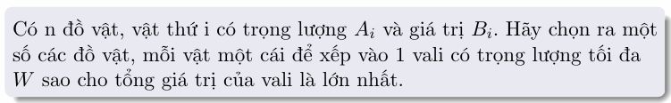
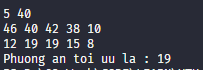
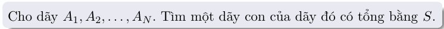
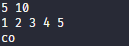
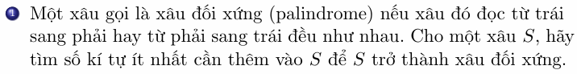
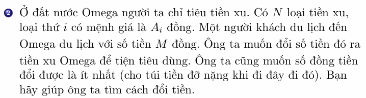
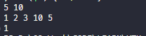
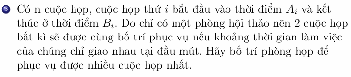
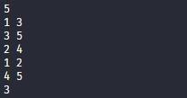

Sv. Huỳnh Vũ Nhật Linh |
CN2304CLCB  
Source Code: [github.com/linhhuynhcoding/](https://github.com/linhhuynhcoding/UTH-assignment/tree/master/d%26aAlgo/Lab5)

# Dynamic Programming (Quy Hoạch Động)

### BÀI TOÁN KNAPSACK 

```cpp
    int w;
    cin >> n >> w;
    vector<pair <int, int>> dovat(n);
    for (auto &[u, v] : dovat) cin >> u;
    for (auto &[u, v] : dovat) cin >> v;

    int f[n + 1][w + 1];
    for (int i = 0; i <= n; i++)
        f[i][0] = 0;
    for (int i = 0; i <= w; i++)
        f[0][i] = 0;

    for (int i = 1; i <= w; i++){
        for (int j = 1; j <= n; j++) {
            auto [x, v] = dovat[j - 1];
            f[j][i] = f[j - 1][i];
            if (x > i) continue;

            f[j][i] = max(f[j][i], f[j - 1][i - x] + v);
        }
    }
    
    cout << "Phuong an toi uu la : ";
    cout << f[n][w]; 
```



### DÃY CON CÓ TỔNG BẰNG S


```cpp
    int s;
    cin >> n >> s;
    vector <int> a(n);
    for (auto &i : a) cin >> i;
    bool f[n + 1][s + 1];
    int trace[s + 1];

    for (int i = 0; i <= s; i++)
        f[0][i] = false;
    for (int i = 0; i <= n; i++)
        f[i][0] = true;
    
    for (int i = 1; i <= s; i++){
        for (int j = 1; j <= n; j++){
            if (a[j - 1] > i) {
                f[j][i] = f[j - 1][i];       
                continue;
            }
            if (f[j - 1][i - a[j - 1]]) {
                trace[i] = a[j - 1];
                f[j][i] = true;
            }
            else f[j][i] = f[j - 1][i] ;
        }
    }

    if (f[n][s]) cout << "co\n";
    else cout << "khong\n";
```


## BÀI TẬP ỨNG DỤNG 

### BÀI 1

```cpp
#include <iostream>
#include <string>
using namespace std;

const int N = 5010;
int n, d[N][N];
string s;

int calc(int i, int j)
{
    if (d[i][j] == -1)
    {
        if (i >= j)
            d[i][j] = 0;
        else
        {
            if (s[i] == s[j])
                d[i][j] = calc(i + 1, j - 1);
            else
                d[i][j] = 1 + min(calc(i, j - 1), calc(i + 1, j));
        }
    }
    return d[i][j];
}

int main()
{
    cin >> s;
    n = s.length();
    s = "_" + s;
    for (int i = 0; i <= n; i++)
    for (int j = 0; j <= n; j++)
        d[i][j] = -1;
    cout << calc(1, n) << '\n';
}
```
### BÀI 2

``` cpp
    cin >> n >> m;
    vector<int> coins(n);

    for (auto &c : coins) cin >> c;
    int f[m + 1];

    for (int i = 1; i <= m; i++)
        f[i] = INF;

    // f[1] = 0;
    for (int i = 1; i <= m; i++) {
        for (auto c : coins) {
            if (c > i) {
                f[i] = 0;
                continue;
            }
            f[i] = min(f[i], f[i - c] + 1);
        }
    }

    cout << f[m];
```


### BÀI 3

``` cpp
    cin >> n;
    vector<pair<int, int>> schedules(n);
    int fix_min = INF;
    int fix_max = -INF;

    for (auto &[s, f] : schedules){
        cin >> s >> f;
        fix_min = min(fix_min, f);
        fix_max = max(fix_max, f);
    } 

    int dp[fix_max + 1];

    for (int i = 0; i <= fix_max; i++) dp[i] = 0;

    for (int i = 1; i <= fix_max; i++) {
        for (auto [s, f] : schedules) {
            // cout << s << " " << f << "\n";
            if (f != i){
                continue;
            }

            dp[i] = max(dp[i], dp[s] + 1);
        }
    }
    cout << dp[fix_max];
```
