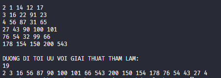
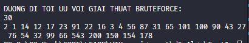

Sv. Huỳnh Vũ Nhật Linh |
CN2304CLCB  
Source Code: [github.com/linhhuynhcoding/](https://github.com/linhhuynhcoding/UTH-assignment/tree/master/d%26aAlgo/Test1)

# TEST

### TIẾP CẬN THAM LAM

``` cpp
    void FindLargestPathGreedy(int x, int y)
    {
        int dx[4] = {1, -1, 0, 0};
        int dy[4] = {0, 0, 1, -1};

        vector <vector<bool>> flag(height, vector <bool> (width, false));

        vector <int> footprint;
        
        queue<pair<int, int>> q;
        q.push({x, y});

        while (!q.empty())
        {
            auto [u, v] = q.front();
            q.pop();
            flag[u][v] = true;
            // cout << "\n";
            // cout << data[u][v] << " ";
            footprint.push_back(data[u][v]);

            int nextweight = -1;
            int targetu = -1;
            int targetv = -1;
            for (int i = 0; i < 4; i++)
            {
                int nextu = u + dx[i];
                int nextv = v + dy[i];

                if (nextu < 0 || nextu >= height)
                    continue;
                if (nextv < 0 || nextv >= width)
                    continue;
                // cout << data[nextu][nextv] << " ";
                if (flag[nextu][nextv] == true)
                    continue;
                if (data[nextu][nextv] < 0) continue;
                

                if (data[nextu][nextv] >= nextweight)
                {
                    nextweight = data[nextu][nextv];
                    targetu = nextu;
                    targetv = nextv;
                }
            }
            if (targetu != -1 && targetv != -1)d
                q.push({targetu, targetv});
        }
        cout << "\nDUONG DI TOI UU VOI GIAI THUAT THAM LAM:\n";
        cout << footprint.size() << "\n";
        for (auto i : footprint) cout << i << " ";
        cout << "\n";
    }
```



### TIẾP CẬN BRUCE FORCE
D

``` cpp
void FindLargestPathBruteForce(int u, int v, long long tong, vector<vector<bool>> visited, vector<int> footprint)
{
    if (visited.size() == 0) {
        visited.assign(height, vector <bool> (width, false));
    }
    int dx[4] = {1, -1, 0, 0};
    int dy[4] = {0, 0, 1, -1};

    footprint.push_back(data[u][v]);
    visited[u][v] = true;
    tong += data[u][v];

    for (int i = 0; i < 4; i++)
    {
        int nextu = u + dx[i];
        int nextv = v + dy[i];

        if (nextu < 0 || nextu >= height)
            continue;
        if (nextv < 0 || nextv >= width)
            continue;
        // cout << data[nextu][nextv] << " ";
        if (visited[nextu][nextv] == true)
            continue;
        if (data[nextu][nextv] < 0)
            continue;
        
        FindLargestPathBruteForce(nextu, nextv, tong, visited, footprint);
    }

    int tmpsum = 0;
    for (int i : footprint) {
        tmpsum += i;
    }
    if (tmpsum >= BFTong) {
        BFTong = tmpsum;
        BFRes = footprint;
    }
}

```

### Độ phức tạp

#### Tham lam : độ phức tạp là O(Số đỉnh + Số cạnh);
#### Brute Force : độ phức tạp là O(4^Số đỉnh);


## Source Code

```cpp
#include <bits/stdc++.h>

using namespace std;

const int INF = 1e9;

int n, m;

class Labyrinth
{
private:
    int width, height;

private:
    vector<vector<int>> data;

public:
    Labyrinth(char FILENAMEINPUT[10])
    {
        ifstream f(FILENAMEINPUT);

        f >> height >> width;

        data.assign(height, vector<int>(width, 0));

        for (int i = 0; i < height; i++)
        {
            for (int j = 0; j < width; j++)
            {
                f >> data[i][j];
            }
        }
    }

public:
    void out()
    {
        for (int i = 0; i < height; i++)
        {
            for (int j = 0; j < width; j++)
            {
                cout << data[i][j] << " \n"[j == width - 1];
            }
        }
    }

public: vector <int> BFRes = {}; 
public: int BFTong = -1; 
public:
    void FindLargestPathBruteForce(int u, int v, long long tong, vector<vector<bool>> visited, vector<int> footprint)
    {
        if (visited.size() == 0) {
            visited.assign(height, vector <bool> (width, false));
        }
        int dx[4] = {1, -1, 0, 0};
        int dy[4] = {0, 0, 1, -1};

        footprint.push_back(data[u][v]);
        visited[u][v] = true;
        tong += data[u][v];

        for (int i = 0; i < 4; i++)
        {
            int nextu = u + dx[i];
            int nextv = v + dy[i];

            if (nextu < 0 || nextu >= height)
                continue;
            if (nextv < 0 || nextv >= width)
                continue;
            // cout << data[nextu][nextv] << " ";
            if (visited[nextu][nextv] == true)
                continue;
            if (data[nextu][nextv] < 0)
                continue;
            
            FindLargestPathBruteForce(nextu, nextv, tong, visited, footprint);
        }

        int tmpsum = 0;
        for (int i : footprint) {
            tmpsum += i;
        }
        if (tmpsum >= BFTong) {
            BFTong = tmpsum;
            BFRes = footprint;
        }
    }

    void BruteForceAnswer(){

        cout << "\nDUONG DI TOI UU VOI GIAI THUAT BRUTEFORCE:\n";

        cout << BFRes.size() << "\n";
        for (auto i : BFRes) cout << i << " ";
    }


public:
    void FindLargestPathGreedy(int x, int y)
    {
        int dx[4] = {1, -1, 0, 0};
        int dy[4] = {0, 0, 1, -1};

        vector<vector<bool>> flag(height, vector<bool>(width, false));

        vector<int> footprint;

        queue<pair<int, int>> q;
        q.push({x, y});

        while (!q.empty())
        {
            auto [u, v] = q.front();
            q.pop();
            flag[u][v] = true;
            // cout << "\n";
            // cout << data[u][v] << " ";
            footprint.push_back(data[u][v]);

            int nextweight = -1;
            int targetu = -1;
            int targetv = -1;
            for (int i = 0; i < 4; i++)
            {
                int nextu = u + dx[i];
                int nextv = v + dy[i];

                if (nextu < 0 || nextu >= height)
                    continue;
                if (nextv < 0 || nextv >= width)
                    continue;
                // cout << data[nextu][nextv] << " ";
                if (flag[nextu][nextv] == true)
                    continue;
                if (data[nextu][nextv] < 0)
                    continue;

                if (data[nextu][nextv] >= nextweight)
                {
                    nextweight = data[nextu][nextv];
                    targetu = nextu;
                    targetv = nextv;
                }
            }
            if (targetu != -1 && targetv != -1)
                    q.push({targetu, targetv});
        }
        cout << "\nDUONG DI TOI UU VOI GIAI THUAT THAM LAM:\n";
        cout << footprint.size() << "\n";
        for (auto i : footprint)
            cout << i << " ";
        cout << "\n";
    }
};

int main()
{
    Labyrinth *lb = new Labyrinth("INPUT.TXT");
    lb->out();
    lb->FindLargestPathGreedy(0, 0);
    lb->FindLargestPathBruteForce(0, 0, 0, {}, {});
    lb->BruteForceAnswer();
}
```